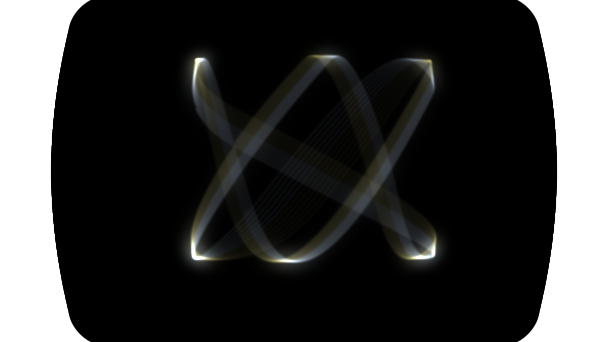

# Astable

> **AI-assisted project.** This codebase was created with [Claude](https://claude.com/claude-code)
> (Anthropic), directed and reviewed by a human author. The circuit is not
> asserted but measured: `attest --period` drives ten (Ra, Rb, C) triples
> through the simulated timers and fails if the period misses
> 0.693 (Ra + 2Rb) C or the duty misses (Ra + Rb) / (Ra + 2Rb) by more than 1%,
> `attest --swing` checks the capacitor really runs between V5/2 and V5, and
> `attest --yoke` fits a coil's step response and fails if the time constant is
> more than 1% out. A control sweep fails if any parameter turns out to do
> nothing. **It has never been loaded into Resolume** — see [Status](#status).

Six 555 timers on a breadboard, patched into the X, Y and brightness of a
television's deflection yoke. An FFGL **source** plugin for
[Resolume](https://resolume.com) Arena and Avenue.



<sub>Rendered by the plugin's own offline harness in a headless GL context — not
a Resolume screen capture. Real frames through the real shipped plugin class.
The figure is brightest at its turnarounds because that is where the beam is
slowest; the yellow trailing edge is P4's slow layer.</sub>

## The one idea

**Nothing here is drawn as a shape. The picture is where the beam went.**

Each timer is simulated at the component level — a capacitor, two comparators,
a flip-flop — and whatever its output and its capacitor are doing is what the
yoke is fed. The renderer deposits a fixed quantum of energy per sample
interval and spreads it over the distance the beam covered, so brightness
proportional to dwell time is what "equal energy per unit time" *means* rather
than a term applied on top.

Everything below falls out of that. None of it is a feature that was added.

- **Two square waves into X and Y give four dots.** The beam sits at a rail,
  crosses to the next in a single interval, and sits again — so the corners get
  nearly all the light and the crossings are faint lines. `attest --dots`
  measures it: **100% of the frame's light** lands in the four spots.
- **An RC on an output turns the dots into lines**, brightest at the end the
  beam is slowest at, because now X takes time to get across.
- **The capacitors instead of the outputs give curves.** The capacitor
  waveform is an exponential between Vcc/3 and 2Vcc/3, so every edge of the
  figure bends.
- **The figure precesses and breathes.** The oscillators are free-running and
  nothing is phase-locked, so two channels a capacitor's tolerance apart beat
  at a few hertz and walk through every phase relationship. That crawl is the
  charm, and it is also why the four dots take a full beat period to all appear.
- **One timer's capacitor into another's pin 5 is FM.** The control-voltage pin
  is the threshold, so driving it sweeps both the frequency and the duty.
- **A yoke is magnetic.** Coil current lags voltage through L/R, so fast edges
  round off and the figure is squarer at low frequency than at high.
- **The Maddi mark/space trick** — a pot across the timing path so the charge
  and discharge share one total resistance — moves the duty and leaves the
  period where it was. `attest --markspace` holds the period to 0.5% while the
  duty goes from 26% to 89%.

## Controls

Eighty-seven of them, in eleven groups. That is a lot, and the honest answer to
"how do I use this" is **start from a Preset**, at the bottom.

**Channel 1–6** — `Ra`, `Rb`, `C Decade`, `C Fine`, `CV Source`, `CV Depth`,
`Mark-Space`, `Reset`, `Filter`, `Level`.

Resistors are 1 kΩ–1 MΩ and capacitors 1 nF–100 µF, as a decade plus a fine
multiplier so a value reads off like a real part — "100 nF × 1.01" is a 100 nF
capacitor that is 1% high, which is what two parts out of the same bag are. The
panel shows the real units: `10.0 kR`, `101.0 nF`, `76% high`, `1.34 ms`.

`Reset` is pin 4: off holds the output low and discharges the capacitor.
`Filter` is an RC on pin 3 measured **in that channel's own periods**, so it
means the same thing on a 2 Hz timer as on a 2 kHz one. `CV Source` is pin 5 —
any channel's output or capacitor, or the audio.

**Patch** — `X Source`, `Y Source`, `Z Source`, `X Gain`, `Y Gain`, `X Offset`,
`Y Offset`, `Z Mode`. Each source picks any channel's output, capacitor or
filtered output. `Z Mode` is Off, Blank When Low, or Brightness Follows.

**Yoke** — `Coil X`, `Coil Y` (the L/R lag per axis; 0 is an electrostatic
scope), `Deflection Gain`, `Amp Rail` (where the deflection amplifier runs out
of headroom and clips).

**Supply** — `Vcc` (5–15 V, shared), `Audio`, `Audio Gain`.

**Tube** — `Phosphor`, `Persistence`, `Focus`, `Face Aspect`, `Corner Radius`,
`Overscan`, `Brightness`. Eight phosphors, from a measured table: **P4** is the
monochrome television white and the default, **P22** is a colour set's three
phosphors driven as one white with the red's millisecond lag intact, and the
other six are vectrix's scope phosphors. Changing phosphor changes the
brightness, because the efficiencies are real.

**Presets** — Four Dots, Lines, Curves, Lissajous Crawl, FM, Duty Sweep,
Raster. Each is the next thing the video does, and each is a whole breadboard
rather than a set of slider positions. A preset covers the six channels, the
patch bay, the yoke and Brightness; the supply and the rest of the tube are left
alone, because which television this is on is a different question from which
breadboard you are watching.

## Where it comes from

Inspired by [Ms Mad Lemon](https://www.youtube.com/@MsMadLemon)'s
*What A 555 Timer Looks Like On A CRT TV* and its follow-ups, which do exactly
this with real 555s and a real television. The mark/space trick modelled here
comes from the comments on that series. [vectrix](https://github.com/stoatworks-labs/vectrix)
credits the same videos, and this plugin uses vectrix's beam renderer — see
[ATTRIBUTIONS.md](ATTRIBUTIONS.md).

Astable is the other half of that pair: vectrix is an oscillator and a
pedalboard into a **lab scope**, and drives it with function generators and
guitar effects. Astable is six **555s on a breadboard** into a **television**,
and its controls are resistors and capacitors.

## Build

```bash
git clone --recursive https://github.com/stoatworks-labs/astable
cd astable
cmake -B build -DCMAKE_BUILD_TYPE=Release
cmake --build build
cmake --install build      # into ~/Documents/Resolume Arena/Extra Effects
```

macOS builds are universal (Apple Silicon + Intel) by default; Windows needs
GLEW via vcpkg. C++17 + GLSL 4.10, FFGL 2.1 with the SDK as a submodule.

## Building and testing

```bash
tools/verify.sh              # everything: 22 checks, about 11 seconds
./build/attest --period      # the datasheet formula, measured
./build/attest --dots        # two squares into X and Y really are four dots
./build/attest --yoke        # a coil's step response is the right exponential
python3 tools/sweep.py       # no dead controls
```

`attest` drives the real plugin class in a headless GL context and its time
comes from a frame counter, so two runs of the same command produce identical
PNGs. `./build/attest --out /tmp/f.png --preset 4` renders a frame;
`--list` prints every parameter with the units the host is shown.

## Status

**v0.1.0, and honestly early.** Dated 2026-09-21.

**Verified on this machine** (M4 Max, macOS 26.4), all 22 checks in
`tools/verify.sh`:

| check | what it establishes |
|---|---|
| `--period` | ten (Ra, Rb, C) triples from 120 Hz to 34 kHz: period and duty both within **0.01%** of the datasheet formula, measured from the edges the yoke sees. The part extremes (2.08 µs and 208 s periods) are exact against the flip-flop's own clock, including one driven at 0.80 samples per period |
| `--swing` | the capacitor runs between V5/2 and V5 within **0.04%**, at rest and with pin 5 driven up and down |
| `--markspace` | the duty goes 26% → 89% while the period holds to **0.000%** |
| `--dots` | **100%** of a frame's light in four spots, accumulated over one 7.4 Hz beat |
| `--yoke` | a 2 ms coil's fitted time constant is **0.44%** out, and the trace is at **63.40%** one τ after the step |
| `--energy` | total light varies **0.0103%** across a 100:1 range of sweep speed |
| `--presets` | seven presets all render, all differ, and row 1 is byte-identical to the defaults |
| `--names` | no name or display string over FFGL's 16 characters |
| `tools/sweep.py` | all **82** swept parameters measurably change the picture; 5 skipped with reasons |
| oxbow | the bundle registers, instantiates and lights pixels in a real FFGL host — reported as `SW Astable` / `AT01` / source |

Render cost, from `attest --bench`: **0.377 ms/frame at 720p, 0.394 at 1080p,
0.871 at 4K** — about 2.4% of a 60 fps frame at 1080p.

**What is NOT established:**

- **It has never been loaded into Resolume.** Everything above was compiled,
  rendered and measured offline against the real plugin class in a headless GL
  context. How the parameters *present* — whether eighty-seven controls in
  eleven groups is usable in the inspector, whether the preset override reads
  sensibly — is untested.
- **Nothing has been checked against a real 555.** The model follows the
  datasheet and the measurements agree with the datasheet, which is a claim
  about internal consistency, not about a part on a breadboard.
- **The Windows build has never been compiled**, let alone run: CI cannot run
  yet because the repo is not on GitHub.
- **No audio has reached it from a host.** The audio path has only ever seen
  the harness's injected flat spectrum, so the bin count and the `sqrt` on the
  magnitudes are taken from the fleet's other plugins rather than measured here.
- No OpenFX port and no browser demo — neither is in scope for 0.1.0.
- No release tag, no website registration. `source/StoatworksAbout.h` and
  `ATTRIBUTIONS.md` are provisional hand copies.

## Diagnostics

`source/Diag.{h,cpp}` writes a log file and nothing else: no crash handler,
since this runs inside someone else's host. It exists for the one failure that
actually happens — a shader that will not compile, which otherwise looks like
"the source does nothing" with no message anywhere. `~/Library/Logs/astable/`.

<!-- attributions:start -->
This project is built on other people's work — see [ATTRIBUTIONS.md](ATTRIBUTIONS.md).
<!-- attributions:end -->

## Licence

MIT. See [LICENSE](LICENSE) and [ATTRIBUTIONS.md](ATTRIBUTIONS.md).
